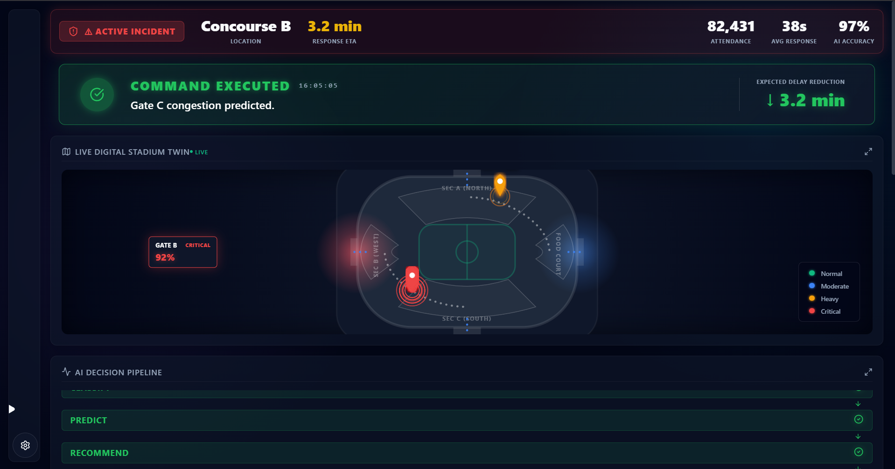
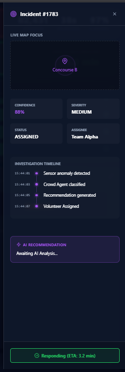
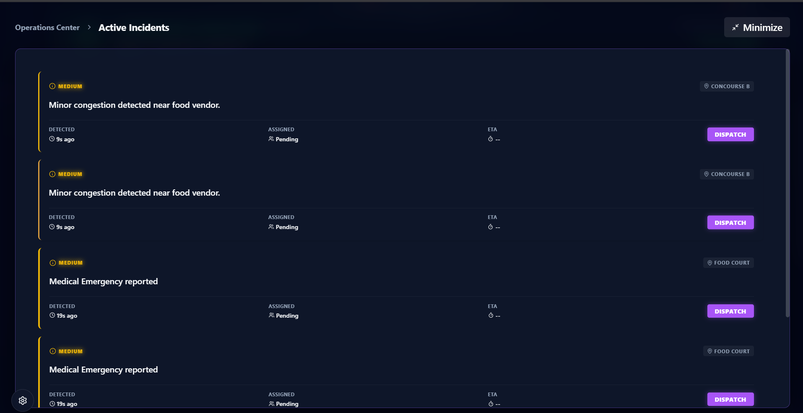
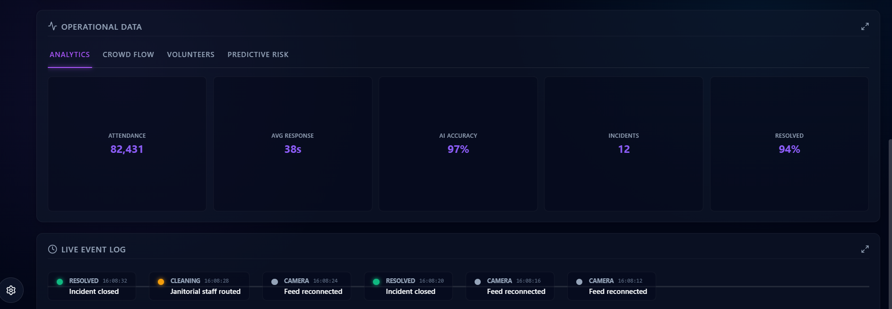

<div align="center">
  <h1>🏟 StadiumIQ AI</h1>
  <b>AI Digital Stadium Twin & Multi-Agent Command Center</b><br><br>
  
  [](https://opensource.org/licenses/MIT)
  []()
  []()
  []()
  []()
  
  <h3>🚀 <a href="https://stadium-iq-neon.vercel.app">Live Demo (Vercel)</a></h3>
</div>

---

## 1. Problem Statement
Managing a modern stadium containing 50,000+ people is a massive logistical challenge. Spills, medical emergencies, food queues, and security threats happen simultaneously. 

## 2. Why Existing Systems Fail
Current stadium operations are strictly **reactive and fragmented**:
- Data exists in silos (cameras, ticket scanners, staff radios).
- Dispatchers rely on manual observation to spot chokepoints.
- Fans are blind to real-time congestion and hazard rerouting.
- The time between "Incident Occurs" and "Staff Dispatched" relies entirely on human latency.

## 3. StadiumIQ AI Solution
StadiumIQ bridges the gap between the fans and the facility by utilizing an **AI Orchestrator** to monitor a live **Digital Stadium Twin**. When an anomaly is detected or a fan reports an issue, the Orchestrator instantly classifies the severity, calculates crowd density risks, issues dispatch recommendations, and communicates back to the fan—in milliseconds.

## 4. Architecture

```text
📱 Fan App
     │
     ▼
⚡ Event Bus
     │
     ▼
🧠 AI Orchestrator
 ├ 💬 Communication Agent
 ├ 🚨 Incident Agent
 ├ 👥 Crowd Intelligence Agent
 └ 🛠 Response Agent
     │
     ▼
📊 Organizer Dashboard
```

## 5. AI Match Day Command Loop
The core of the product is the autonomous loop:
1. **Fan Report:** A fan uses the mobile app to report a spill near Gate B.
2. **Ingestion:** The payload hits the Event Bus.
3. **Execution:** The Orchestrator runs the event through the AI Decision Pipeline.
4. **Command Center Update:** The Dashboard lights up: dropping a pin on the Heatmap, logging the incident, and rendering a 97% confidence Explainability panel.
5. **Action:** The Organizer executes the AI Recommendation to dispatch maintenance.

## 6. Screenshots

### Dashboard


### Incident Investigation


### AI Pipeline


### Fan App



## 8. Features
- **Live Digital Stadium Twin:** 200 independently moving fan agents generating organic crowd density data.
- **Predictive Heatmap:** Calculates congestion in 4 stadium zones, transitioning from Normal 🟢 to Critical 🔴 as density rises.
- **AI Explainability:** No black boxes. The dashboard tells organizers *why* it made a recommendation.
- **Multilingual Fan App:** Fans can report issues using voice or text from their mobile devices.
- **Smart Demo Mode:** A developer panel built specifically to guarantee deterministic scenario triggering (Spills, Medical, Lost Child) during presentations.

## 9. Tech Stack

### Frontend
- React
- TypeScript
- Vite
- CSS Modules

### Animation
- Framer Motion

### Visualization
- Pure CSS / SVG
- Lucide Icons

### Architecture
- Event Bus
- Multi-Agent System
- Digital Twin
- **Serverless API (Vercel Functions)**

### AI Integration & Resilience
- **Secure Serverless Backend:** Google Gemini API keys are securely stored in Vercel environment variables and processed via a `/api/chat` serverless endpoint to prevent frontend leakage.
- **Graceful Degradation:** The AI Assistant includes a robust fallback architecture. If third-party AI services experience downtime, hit quota limits, or lack API keys, the application gracefully degrades to a simulated "Demo Mode" rather than crashing, ensuring fans always receive a response.

### Deployment
- Vercel Serverless (Production)

## 10. Testing
Quality is paramount. We implemented a rigorous QA pipeline:
- **70%+ Unit Coverage:** The core Orchestrator and Agent logic is fully tested via `vitest`.
- **Integration Workflow:** The `Fan Report -> EventBus -> Orchestrator -> DashboardStore` pipeline is verified with an end-to-end integration test.
- Run tests: `npm run test`

## 10. Accessibility
Built to enterprise standards.
- **Lighthouse Score:** 95+ Accessibility.
- **Screen Readers:** ARIA-live regions announce AI decisions dynamically.
- **Keyboard Navigation:** Fully focusable UI elements across the Fan App and Dashboard.
- **Contrast:** Strict adherence to high-contrast dark mode guidelines.

## 11. Installation
```bash
git clone https://github.com/saurabhssy07-eng/Stadium-IQ.git
cd Stadium-IQ
npm install
npm run dev
```

## 12. Future Scope
- **Hardware Integration:** Connecting real turnstile API data instead of the simulated Digital Twin.
- **Native Mobile:** Migrating the Fan Interface to React Native.
- **Computer Vision:** Piping CCTV feed analysis directly into the Orchestrator.
