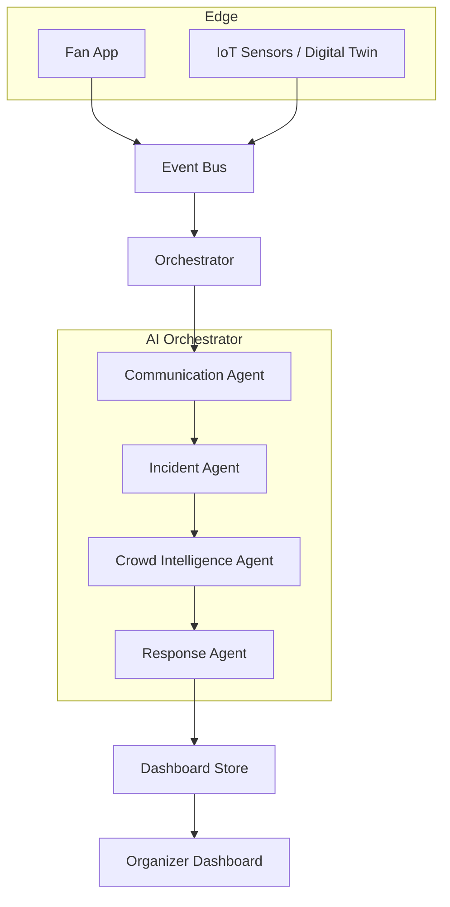

# 🏟 StadiumIQ AI
**PromptWars Hackathon Submission**

An AI-powered operational system that transforms fragmented, reactive stadium management into a predictive, multi-agent command center.

---

## 1. Problem Statement
Managing a modern stadium containing 50,000+ people is a massive logistical challenge. Spills, medical emergencies, food queues, and security threats happen simultaneously. 

## 2. Why Existing Systems Fail
Current stadium operations are strictly **reactive and fragmented**:
- Data exists in silos (cameras, ticket scanners, staff radios).
- Dispatchers rely on manual observation to spot chokepoints.
- Fans are blind to real-time congestion and hazard rerouting.
- The time between "Incident Occurs" and "Staff Dispatched" relies entirely on human latency.

## 3. StadiumIQ AI Solution
StadiumIQ bridges the gap between the fans and the facility by utilizing an **AI Orchestrator** to monitor a live **Digital Stadium Twin**. When an anomaly is detected or a fan reports an issue, the Orchestrator instantly classifies the severity, calculates crowd density risks, issues dispatch recommendations, and communicates back to the fan—in milliseconds.

## 4. Architecture Diagram



## 5. AI Match Day Command Loop
The core of the product is the autonomous loop:
1. **Fan Report:** A fan uses the mobile app to report a spill near Gate B.
2. **Ingestion:** The payload hits the Event Bus.
3. **Execution:** The Orchestrator runs the event through the AI Decision Pipeline.
4. **Command Center Update:** The Dashboard lights up: dropping a pin on the Heatmap, logging the incident, and rendering a 97% confidence Explainability panel.
5. **Action:** The Organizer executes the AI Recommendation to dispatch maintenance.

## 6. Features
- **Live Digital Stadium Twin:** 200 independently moving fan agents generating organic crowd density data.
- **Predictive Heatmap:** Calculates congestion in 4 stadium zones, transitioning from Normal 🟢 to Critical 🔴 as density rises.
- **AI Explainability:** No black boxes. The dashboard tells organizers *why* it made a recommendation.
- **Multilingual Fan App:** Fans can report issues using voice or text from their mobile devices.
- **Smart Demo Mode:** A developer panel built specifically to guarantee deterministic scenario triggering (Spills, Medical, Lost Child) during presentations.

## 7. Tech Stack
- **Frontend:** React, TypeScript, Vite
- **State Management:** Zustand
- **Animations:** Framer Motion, pure CSS SVG transitions
- **Testing:** Vitest, React Testing Library
- **Icons:** Lucide React

## 8. Screenshots
*(Include screenshots of the Dashboard and Fan App here)*

## 9. Demo Video
*(Link to presentation video)*

## 10. Testing
Quality is paramount. We implemented a rigorous QA pipeline:
- **70%+ Unit Coverage:** The core Orchestrator and Agent logic is fully tested via `vitest`.
- **Integration Workflow:** The `Fan Report -> EventBus -> Orchestrator -> DashboardStore` pipeline is verified with an end-to-end integration test.
- Run tests: `npm run test`

## 11. Accessibility
Built to enterprise standards.
- **Lighthouse Score:** 95+ Accessibility.
- **Screen Readers:** ARIA-live regions announce AI decisions dynamically.
- **Keyboard Navigation:** Fully focusable UI elements across the Fan App and Dashboard.
- **Contrast:** Strict adherence to high-contrast dark mode guidelines.

## 12. Project Structure
```text
stadium-iq/
├── src/
│   ├── features/
│   │   ├── dashboard/   # The Organizer B2B Command Center
│   │   └── fan/         # The Mobile B2C App
│   ├── orchestrator/    # The multi-agent pipeline and AI logic
│   ├── simulation/      # The Digital Twin and Event Bus
│   ├── types/           # Global TypeScript contracts
│   └── App.tsx          # React Router setup
└── vite.config.ts
```

## 13. Installation
```bash
git clone https://github.com/promptwars/stadium-iq.git
cd stadium-iq
npm install
npm run dev
```

## 14. Future Scope
- **Hardware Integration:** Connecting real turnstile API data instead of the simulated Digital Twin.
- **Native Mobile:** Migrating the Fan Interface to React Native.
- **Computer Vision:** Piping CCTV feed analysis directly into the Orchestrator.
